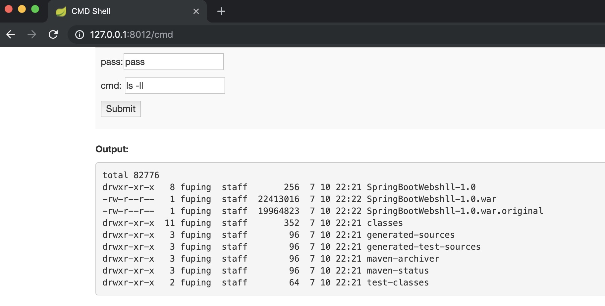
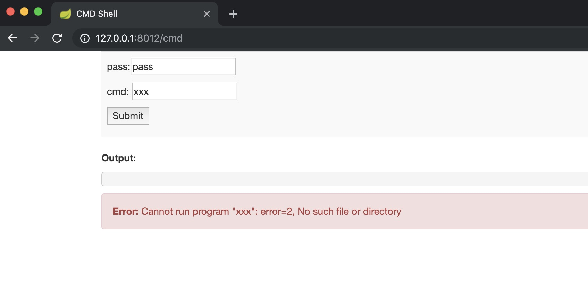
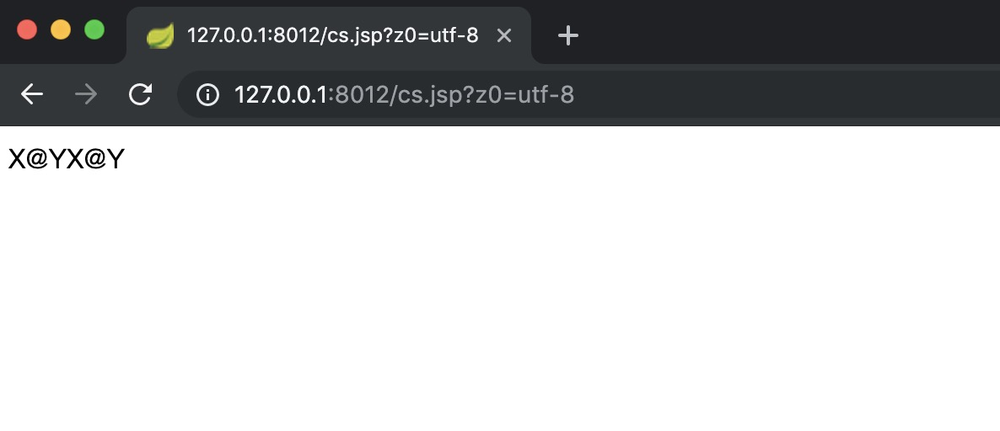
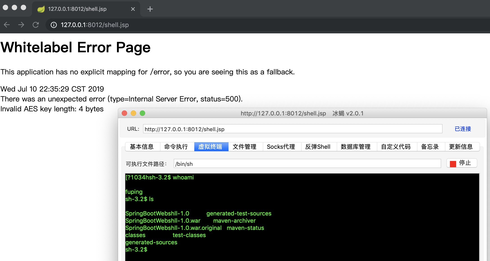

# SpringBootWebshell

Springboot的一个webshell。

主要包含cmdshell和jspshell，可以自定义添加自己所需的jspshell。

###目录结构

```
├── README.md
├── pom.xml
└── src
    ├── main
    │   ├── java
    │   │   └── com
    │   │       ├── ShellApplication.java
    │   │       └── controller
    │   │           └── IndexController.java  		---	cmdshell，密码pass
    │   ├── resources
    │   │   ├── application.properties						---	配置文件，端口默认8012
    │   │   ├── static
    │   │   │   ├── css
    │   │   │   │   └── bootstrap.min.css
    │   │   │   └── js
    │   │   │       └── bootstrap.js
    │   │   └── templates
    │   │       └── index.html
    │   └── webapp
    │       ├── WEB-INF
    │       │   └── web.xml
    │       ├── cs.jsp						---	菜刀马，密码pass(已删除)
    │       ├── shell.jsp					---	冰蝎自带shell，密码pass
    │       ├── shell.jspx				---	冰蝎自带shell，密码pass
    │       └── test.jsp					---	测试文件，输出hello world
    └── test
        └── java
```

> 添加jspshell时，将jsp文件放入在webapp目录下即可。


### 使用方法

采用mvn编译，java版本1.8

编译：`mvn clean package -DskipTests=true`

运行：

```
cd target
java -jar SpringBootWebshll-1.0.war
```
>默认端口为8012，可以在application.properties中配置。


#### cmdshell

http://127.0.0.1:8012/cmd








#### jsp shell

 ~~菜刀马：http://127.0.0.1:8012/cs.jsp 密码：pass~~~~[已删除]




 


冰蝎：http://127.0.0.1:8012/shell.jsp 密码：pass





